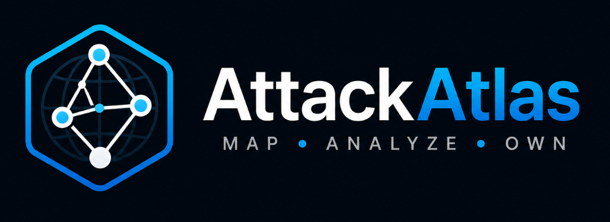
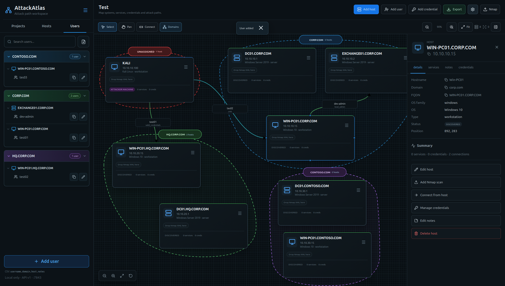
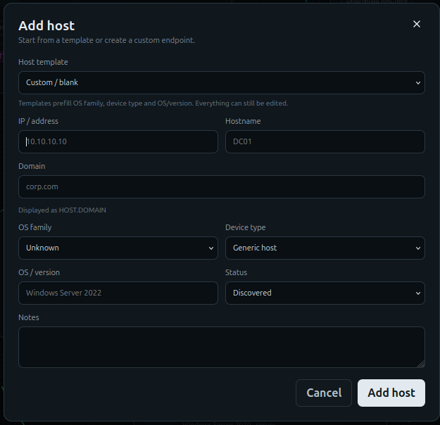
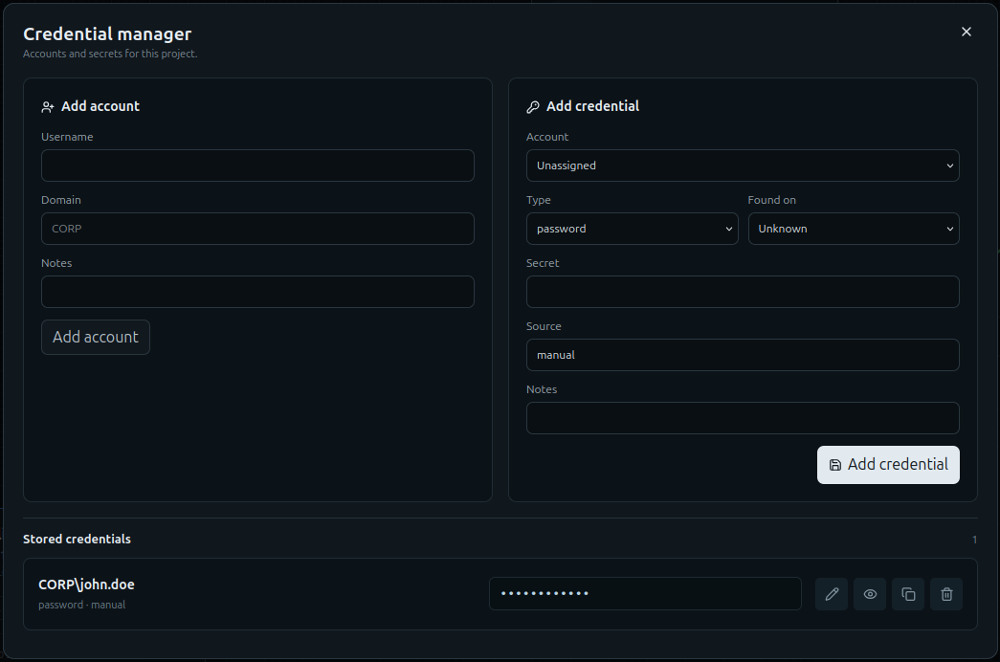

<p align="center">
  
</p>

AttackAtlas is a lightweight, local-first workspace for visualizing hosts, services, users, credentials and attack paths during authorized penetration tests, CTFs and lab environments.

Everything runs locally and is accessed through a browser.

This tool was born out of the idea to be able to visually document and present attack paths discovered during a CTF like an Active Directory range, or even a single machine in a semi-automated way. 
Historically I've been using web tools like Draw.io to do this but it's a lot of manual work which frankly took to much time, especially when doing write-ups or walkthroughs.



## Highlights

- Free-form canvas with draggable hosts and persistent layouts
- Domain-aware visual grouping and editable attack paths
- Nmap XML import with services, NSE output and per-port scan context
- Host templates for common Windows, Linux and macOS systems
- User and credential management with host associations
- Structured host notes with Markdown, categories, tags, timestamps, and screenshot evidence
- Live project Report that updates as host notes change
- Report Timeline and editable project-level report text
- Portable Markdown report export with attached evidence images
- SVG snapshots of the current visualization
- REST API with OpenAPI documentation
- Local SQLite storage and a single-container Docker deployment

| Add host | Credential manager |
| --- | --- |
|  |  |

## Quick start

Docker Compose v2:

```bash
docker compose up --build -d
```

Docker Compose v1:

```bash
docker-compose up --build -d
```

Open:

```text
http://127.0.0.1:7843
```

API docs:

```text
http://127.0.0.1:7843/api/docs
```

AttackAtlas binds to localhost by default. To use another host-side port:

```bash
ATTACKATLAS_PORT=9127 docker compose up --build -d
```

For Compose v1, replace `docker compose` with `docker-compose`.

## Imports

### Nmap XML

Generate XML with Nmap and drag the resulting file onto the project canvas. A single-host XML file can also be dropped directly onto an existing host.

```bash
nmap -sC -sV -p- 10.10.10.0/24 -oX scan.xml
```

Repeated imports are merged and services are deduplicated.

### Users CSV

Users can be added manually or imported from UTF-8 CSV:

```csv
username,domain,host,notes
administrator,CORP,DC01,Domain admin
svc_backup,CORP,10.10.10.20,Found in backup config
```

`host` may be a hostname or address already present in the project. Leave it blank for an unassigned user.

## Data and security

Persistent data is stored in:

```text
./data/attackatlas.db
```

AttackAtlas may contain sensitive assessment data. Credential secrets are encrypted at rest in SQLite with AES-256-GCM. On first start, AttackAtlas creates a random local vault key in:

```text
./secrets/credential-vault.json
```

The key is intentionally stored separately from `./data/attackatlas.db`. Back up **both** directories. A database copied without the key does not reveal credential plaintext; however, anyone who obtains both the database and vault key can decrypt the credentials. This initial vault mode does not use a master password.

Complete Markdown exports may still contain plaintext credentials. Keep `data/`, `secrets/` and exports on trusted or encrypted storage.

See [SECURITY.md](SECURITY.md) before exposing AttackAtlas beyond localhost.

## Development status

**v0.1.0-alpha** is the initial public alpha release. Interfaces, schemas and workflows may change while the project matures.

Bug reports and focused feature proposals are welcome through GitHub Issues. Code contributions should be developed in a fork and submitted as a focused pull request; larger changes should be discussed in an Issue first.

See [CONTRIBUTING.md](CONTRIBUTING.md) and [CHANGELOG.md](CHANGELOG.md).

## Stack

- Python / FastAPI / SQLite
- React / TypeScript / Vite
- Docker / Docker Compose


## Live Report and host notes

AttackAtlas includes structured per-host notes for documenting enumeration, access, privilege escalation, credentials, commands, findings, and other assessment activity. Notes support Markdown, timestamps, tags, and screenshot evidence.

The **Report** view is live: linked host notes appear automatically and changes made to those notes are reflected in the report. You can also add project-level report text directly from the Report view and switch to **Timeline** for a chronological view of recorded activity.

Screenshots can be attached as evidence and are stored under the project data directory. Markdown report exports include the referenced images in an `assets/` directory so the report remains portable.

Credential secrets are redacted in the generated live `report.md` by default. Treat all project exports and evidence as sensitive assessment data.

## License

GNU General Public License v3.0 (GPLv3) — see [LICENSE](LICENSE).
